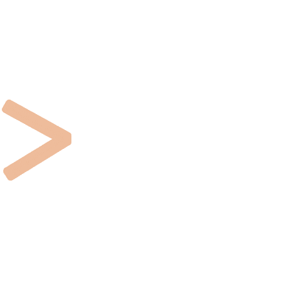

<h1 align="center">Hi , I'm Nafisa Parveen</h1>
<h3 align="center">   A passionate Backend developer from India </h3> 
Dedicated Java Backend Developer with proven performance in management, communication, and creative thinking skills. A problem-solving mindset with a goal to optimize my application for better stability and speed. Always hard working and looking forward to learning new skill.

<h2 align="center"></h2>

  

- 🌱 I’m currently learning **Spring Boot** &nbsp; 

- 👨‍💻 Checkout my [ Portfolio ](nafisa1117.github.io/) &nbsp; 

- 📄 Know about my experiences [Resume](https://drive.google.com/file/d/1VebcjBEOHY4Fj4DNvp36zWfwgxgJs9Cp/view?usp=sharing) &nbsp; 

- 📫 How to reach me **arshirayeen700@gmail.com**  &nbsp; 

<h3 align="left">Connect with me: </h3>

<h3 align="left">Languages and Tools: </h3>

       

   <h2>Quick Stats about me: </h2>

  | Github Stats | Current Strek  |
| --- | --- |
|  |  |

<!-- Theme color -->
<!-- dark, radical, merko, gruvbox, tokyonight, onedark, cobalt, synthwave, highcontrast, dracula -->

| Top Languages | Contribution Graph  |
| :--- | --- |
|  |  |

  
<h2>&nbsp; Some Programming Humor for you </h2>

  

 
